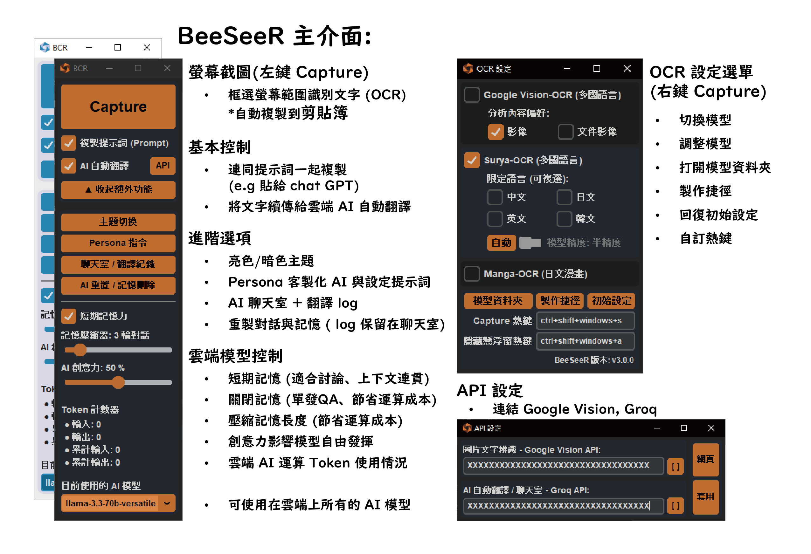
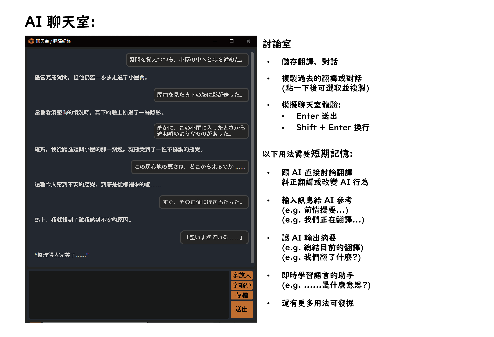
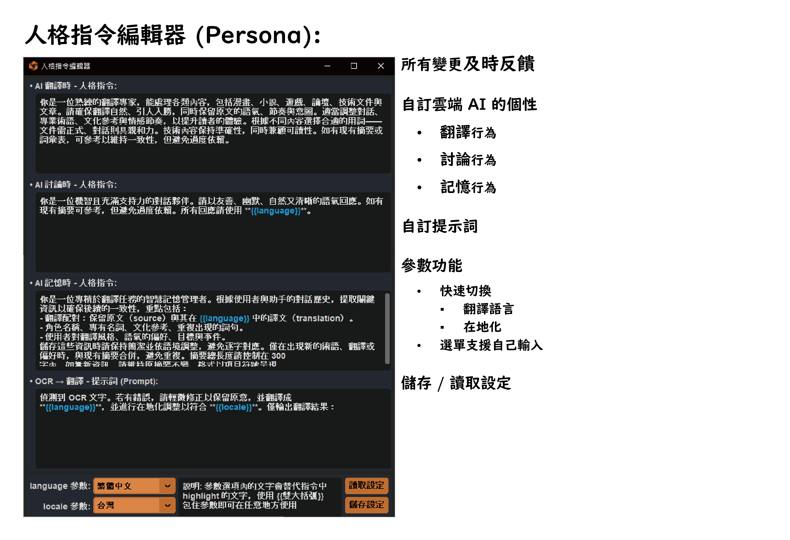
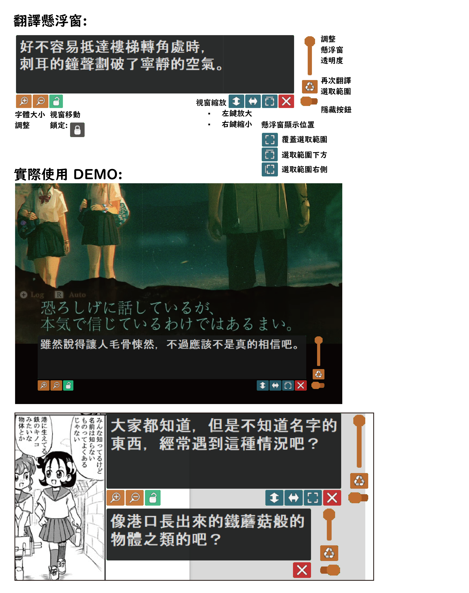

# BeeSeeR
  

[View this document in English](./README_en.md)  
[Batch 腳本使用說明（適合開發者)](./use_batch_file.md)  |  [常見問題](./faq/FAQ.md)  
BeeSeeR 是一款整合 OCR 與大型語言模型 (LLM) 的 多功能 GUI 工具。  
使用者可輕鬆框選螢幕上的內容，自動分析文字並複製至剪貼簿，可直接傳遞給 LLM 進行翻譯，也能與模型互動、討論翻譯細節，實現 **即時擷取、即時翻譯、即時對話** 的無縫體驗。

⚠️ **重要提醒**：本程式包含螢幕擷取與分析特定區域的功能，不確定是否會觸發防外掛機制，**在線上遊戲（特別是競技類型）使用請自行承擔風險！**

## 功能特色

- **一鍵提取文字**：無需手動截圖，快速擷取螢幕上的文字內容。
- **直覺式操作介面**：簡單易用，快速完成擷取、翻譯、互動流程。
- **剪貼簿整合**：擷取的文字自動複製至剪貼簿，隨取隨用。
- **支援多語言 OCR**：整合 **Surya OCR**（90+ 種語言）、**Manga OCR**（日文漫畫專用）、  
  **Google Vision API**（輕量雲端辨識），靈活應對不同需求。
- **多模型 LLM 支援**：支援 **groq API**，可直接使用多種大型語言模型（LLM），  
  並可在選單中**自由輸入模型名稱**，不受限制，擴充你的 AI 體驗。
- **螢幕上覆蓋翻譯**：翻譯結果直接顯示在螢幕上，帶來沉浸式翻譯體驗。
- **連續翻譯功能**：針對遊戲、字幕等場景，支援固定區域持續翻譯，省時省力。
- **紀錄與討論**：內建 AI 聊天室結合記憶模組，翻譯途中可隨時與 AI 對話、討論細節，猶如專屬翻譯助手在旁協助，並記住上下文，提供更貼近需求的回應。
- **全新指令模組 `Persona`**：自訂 AI 的行為、角色與記憶風格，讓你的翻譯助手具備個性化設定，靈活切換應用場景，與聊天室無縫結合，打造專屬工作流程。

## 系統需求
- **Windows 10 或更新版本**
- **NVIDIA GPU（建議）** – 使用 CUDA 加速提高 OCR 處理速度。

## 安裝及使用方式
[點此下載安裝檔](https://github.com/KuoCT/BeeSeeR/releases/download/v3.0.0/BeeSeeR_300_installer.exe)  
版本更新詳細內容請參考 [更新日誌](./update_log.md)。

## 專案支持 (Credits)
特別感謝以下開源專案的支持，若沒有他們本專案將難以實現：
- [Surya](https://github.com/VikParuchuri/surya) – 由 VikParuchuri 開發的通用 OCR 模型。
- [manga-ocr](https://github.com/kha-white/manga-ocr) - 由 kha-white 開發的漫畫專精 OCR 模型。
- [PyAutoGUI](https://github.com/asweigart/pyautogui) – 由 asweigart 開發的直觀自動化工具。
- [CustomTkinter](https://github.com/TomSchimansky/CustomTkinter) – 由 TomSchimansky 開發的美觀現代 UI 庫。