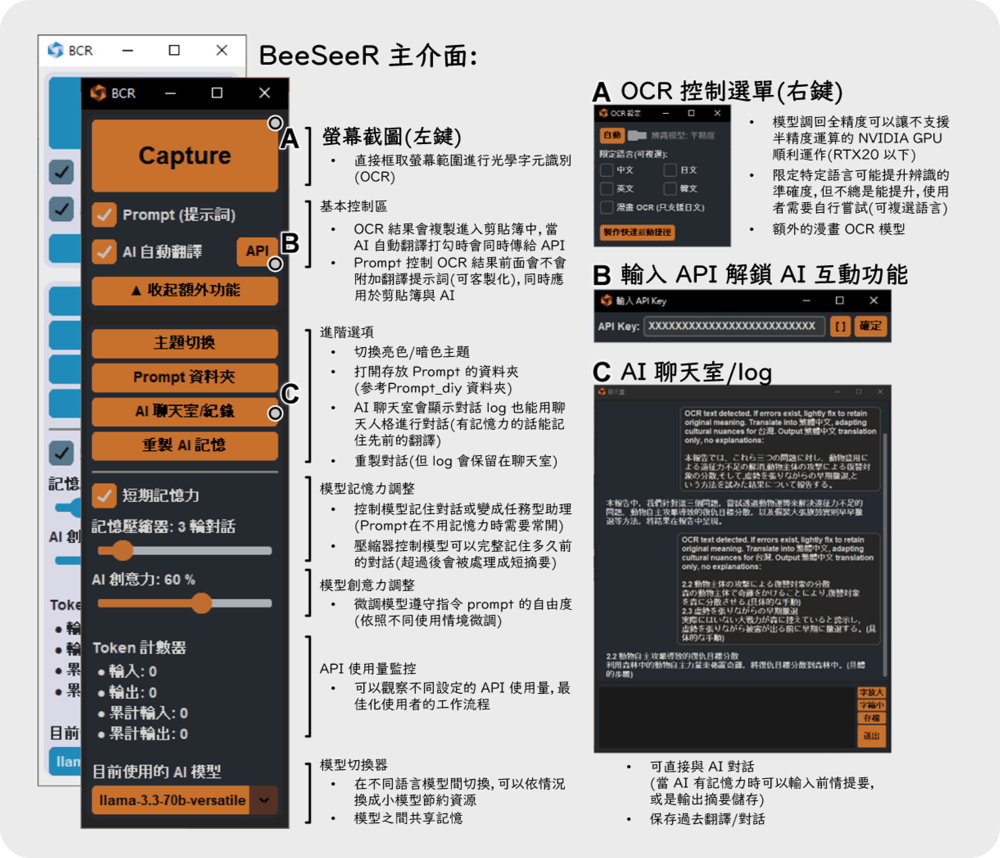
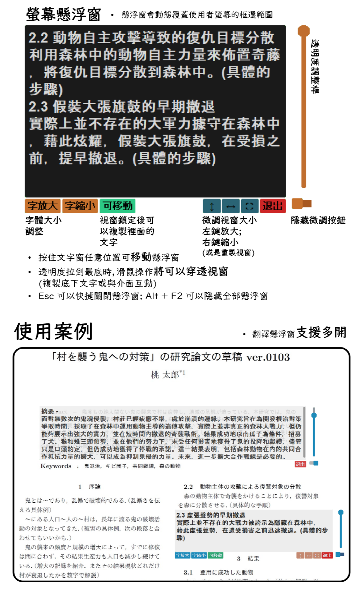

# BeeSeeR
[English](./README_en.md)

BeeSeeR 是一個整合螢幕截圖 + OCR + AI 的 GUI 工具，使用者能透過類似螢幕截圖的操作方法擷取螢幕文字並使用大型語言模型達成特定任務(e.g. 翻譯、統整等等)。

⚠ **重要提醒:** 這個腳本因為用到選擇電腦桌面特定區域等等的自動化功能，我不確定會不會觸發防外掛程式，如果要在線上遊戲中(特別是競技遊戲)使用要自行承擔後果喔！

## 軟體介紹



## 功能特色
- **一鍵提取文字**: 無需手動儲存截圖。
- **直覺式操作介面**: 快速擷取並識別文字。
- **剪貼簿整合**: 文字自動複製，方便貼上。
- **支援多種語言**: OCR 以 `Surya模型` 為基礎，可適應90+種語言。
- **解鎖 AI 整合**: 支援 groq API，可直接使用大語言模型分析文字。
- **螢幕上覆蓋**: 翻譯後的文字直接螢幕上覆蓋，沉浸式翻譯體驗。
- **聊天室與客製化提示詞**: AI 聊天室與 Prompt diy 打造自己的客製化翻譯助理。

## 系統需求
- **Windows 10/11**
- **Python 3.10 - 3.13**
- **NVIDIA GPU（建議）** – 使用 CUDA 加速提高 OCR 速度。

## 下載
- 複製存儲庫到電腦
   ```bash
   git clone https://github.com/KuoCT/BeeSeeR.git
   cd BeeSeeR
   ```

## 首次安裝
### 方案 1: 使用 NVIDIA GPU 加速的 `兼容模式` (推薦使用)
- 執行 `BeeSeeR.bat` 進行首次安裝。
- 首次安裝完成後，使用者可以自由切換成 CPU 模式，只要編輯`BeeSeeR.bat` 設定 `mode` 成 `1`:
   ```bat
   :: 設定模式（0 為兼容模式，1 為強制CPU模式）
   set mode=1
   ```
- 設定 `debug` 成 `0` 可以隱藏 terminal 視窗(確定可以正常運行後使用):
   ```bat
   :: 設定 debug 變數（0 為背景執行模式，1 為除錯模式）
   set debug=0
   ```
- 存檔 `BeeSeeR.bat` 供後續使用。

### 方案 2: 使用 `強制 CPU 模式` (占用空間較小，處理速度較慢，適合沒有 NVIDIA GPU 的使用者)
- 編輯 `BeeSeeR.bat` 設定 `mode` 成 `1`，然後不要更改它。
- 執行 `BeeSeeR.bat` 進行首次安裝。
- 首次安裝完成後，在 `BeeSeeR.bat` 中設定 `debug` 成 `0` 可以隱藏 terminal 視窗(確定可以正常運行後使用)
- 存檔 `BeeSeeR.bat` 供後續使用。

首次運行可能需要一些時間，因為會自動安裝所需的依賴項。**請等到OCR小視窗彈出表示安裝完成。** 🛠 **工具:** `fix.bat` 可以幫你解除安裝 pytorch 相關的套件，需要修改初始安裝成 `兼容模式` 或是 `強制 CPU 模式` 時使用。

## 版本更新
- 備份編輯過的文件 (prompt資料夾, config.json 等等...) 
- 刪除 `BeeSeeR.bat`，在 `BeeSeeR` 資料夾中執行以下命令
   ```bash
   git pull
   ```
- 用 `debug=1` 模式啟動 `BeeSeeR.bat` 到程式順利彈出。
- 切回 `debug=0` 繼續使用。

版本更新詳細請參考[更新日誌](./Update_log.md)。

## 使用方式
執行 `BeeSeeR.bat`即可。

## 致謝
特別感謝以下開源專案的支持：
- [Surya](https://github.com/VikParuchuri/surya) – 由 VikParuchuri 開發的強大 OCR 模型。
- [PyAutoGUI](https://github.com/asweigart/pyautogui) – 由 asweigart 開發的直觀自動化工具。
- [CustomTkinter](https://github.com/TomSchimansky/CustomTkinter) – 由 TomSchimansky 開發的美觀現代 UI 庫。
