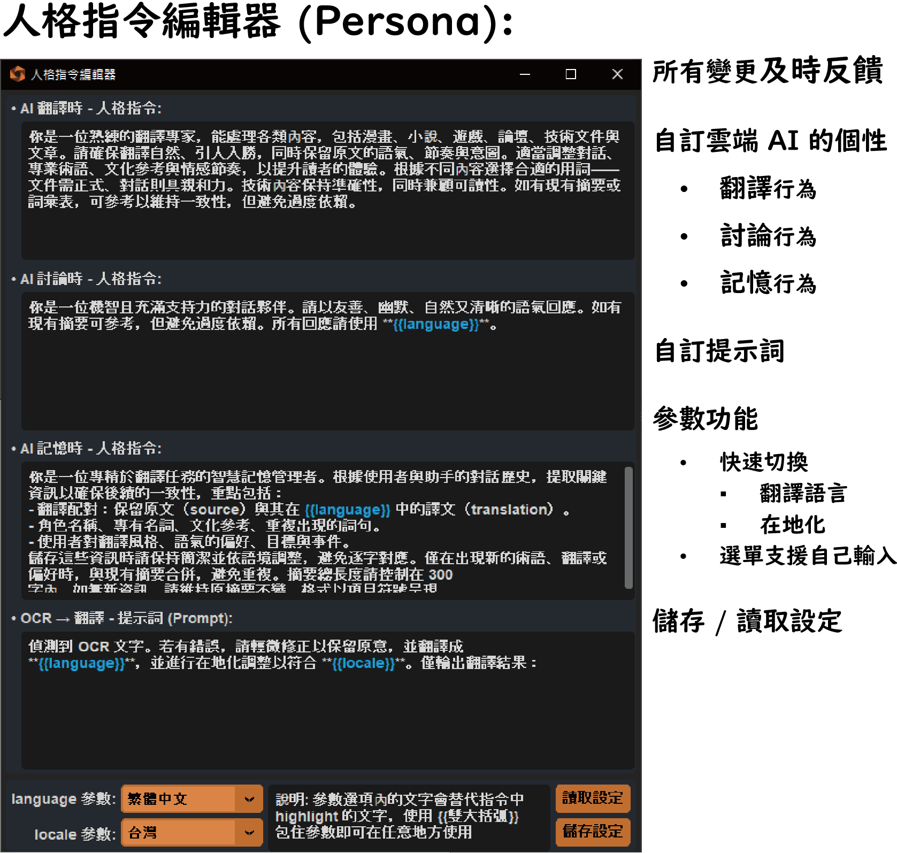
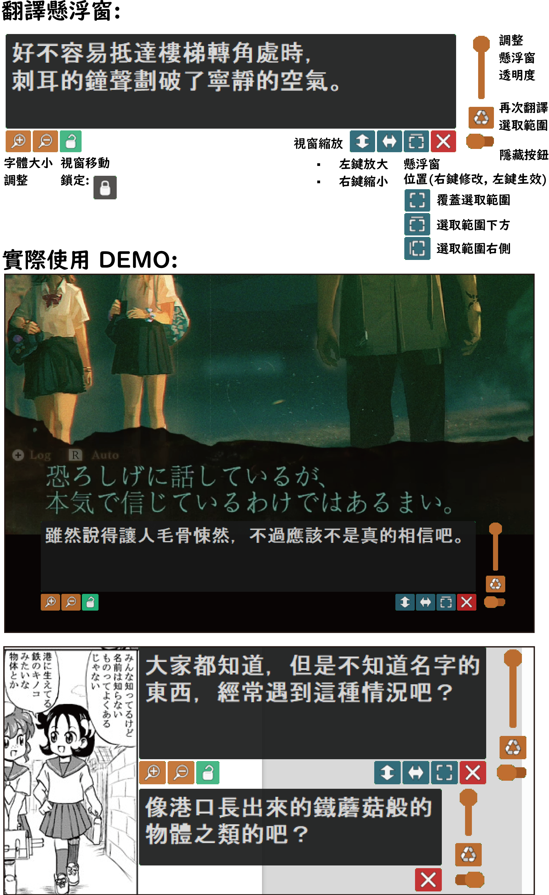

# BeeSeeR
[View this document in English](./README_en.md)  
[Batch 腳本使用說明（適合開發者）](./use_batch_file.md)

BeeSeeR 是一款整合 OCR 與大型語言模型 (LLM) 的 多功能 GUI 工具。  
使用者可輕鬆框選螢幕上的內容，自動分析文字並複製至剪貼簿，可直接傳遞給 LLM 進行翻譯，也能與模型互動、討論翻譯細節，實現 **即時擷取、即時翻譯、即時對話** 的無縫體驗。

⚠️ **重要提醒**：本程式包含螢幕擷取與分析特定區域的功能，不確定是否會觸發防外掛機制，**在線上遊戲（特別是競技類型）使用請自行承擔風險！**

## 功能特色

- **一鍵提取文字**：無需手動截圖，快速擷取螢幕上的文字內容。
- **直覺式操作介面**：簡單易用，快速完成擷取、翻譯、互動流程。
- **剪貼簿整合**：擷取的文字自動複製至剪貼簿，隨取隨用。
- **支援多語言 OCR**：整合 **Surya OCR**（90+ 種語言）、**Manga OCR**（日文漫畫專用）、  
  **Google Vision API**（輕量雲端辨識），靈活應對不同需求。
- **多模型 LLM 支援**：支援 **groq API**，可直接使用多種大型語言模型（LLM），  
  並可在選單中**自由輸入模型名稱**，不受限制，擴充你的 AI 體驗。
- **螢幕上覆蓋翻譯**：翻譯結果直接顯示在螢幕上，帶來沉浸式翻譯體驗。
- **連續翻譯功能**：針對遊戲、字幕等場景，支援固定區域持續翻譯，省時省力。
- **聊天室與客製化提示詞**：內建 AI 聊天室，可自訂提示詞（Prompt DIY），打造專屬翻譯助理。
- **全新指令模組 `Persona`**：自訂 AI 行為、角色與記憶風格，並可儲存為設定檔，靈活切換應用場景。
- **設定選單完整上線**：支援 **模型快速切換、自訂熱鍵、重置設定**，操作更加直覺、流暢。
- **懸浮窗面板 2.0**：介面全面升級，按鈕更美觀，操作體驗更佳。
- **核心以 C 編譯，效能全面提升**：底層使用 C 編譯（Nuitka 封裝），程式運行更加穩定、流暢。

## 系統需求
- **Windows 10 或更新版本**
- **NVIDIA GPU（建議）** – 使用 CUDA 加速提高 OCR 處理速度。

## 安裝及使用方式
[點此下載安裝檔]()  
版本更新詳細內容請參考 [更新日誌](./update_log.md)。

## 專案支持 (Credits)
特別感謝以下開源專案的支持，若沒有他們本專案將難以實現：
- [Surya](https://github.com/VikParuchuri/surya) – 由 VikParuchuri 開發的通用 OCR 模型。
- [manga-ocr](https://github.com/kha-white/manga-ocr) - 由 kha-white 開發的漫畫專精 OCR 模型。
- [PyAutoGUI](https://github.com/asweigart/pyautogui) – 由 asweigart 開發的直觀自動化工具。
- [CustomTkinter](https://github.com/TomSchimansky/CustomTkinter) – 由 TomSchimansky 開發的美觀現代 UI 庫。