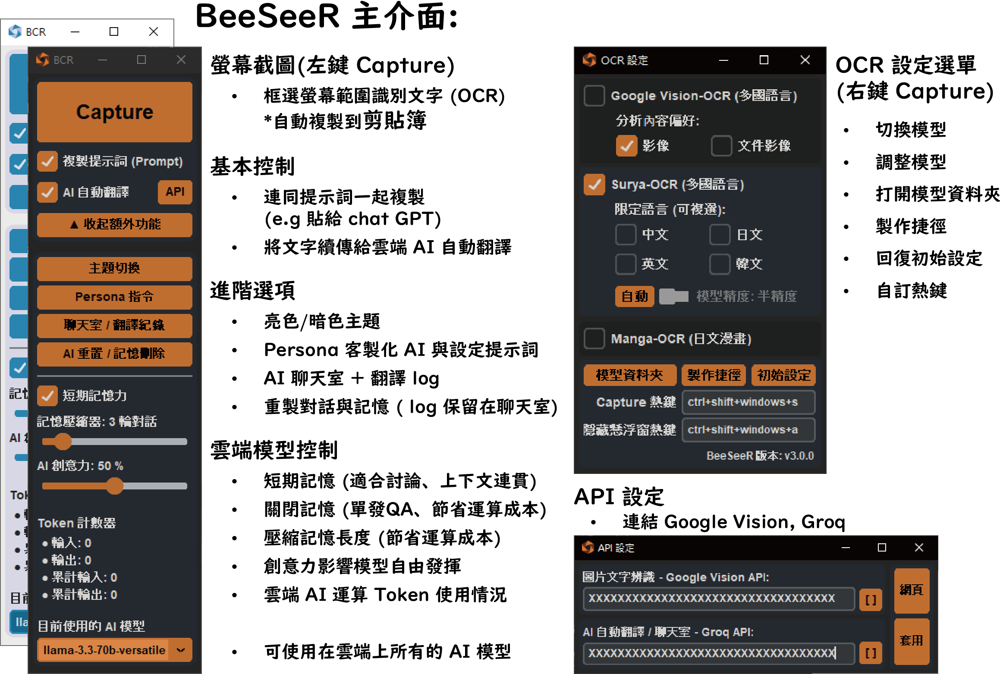
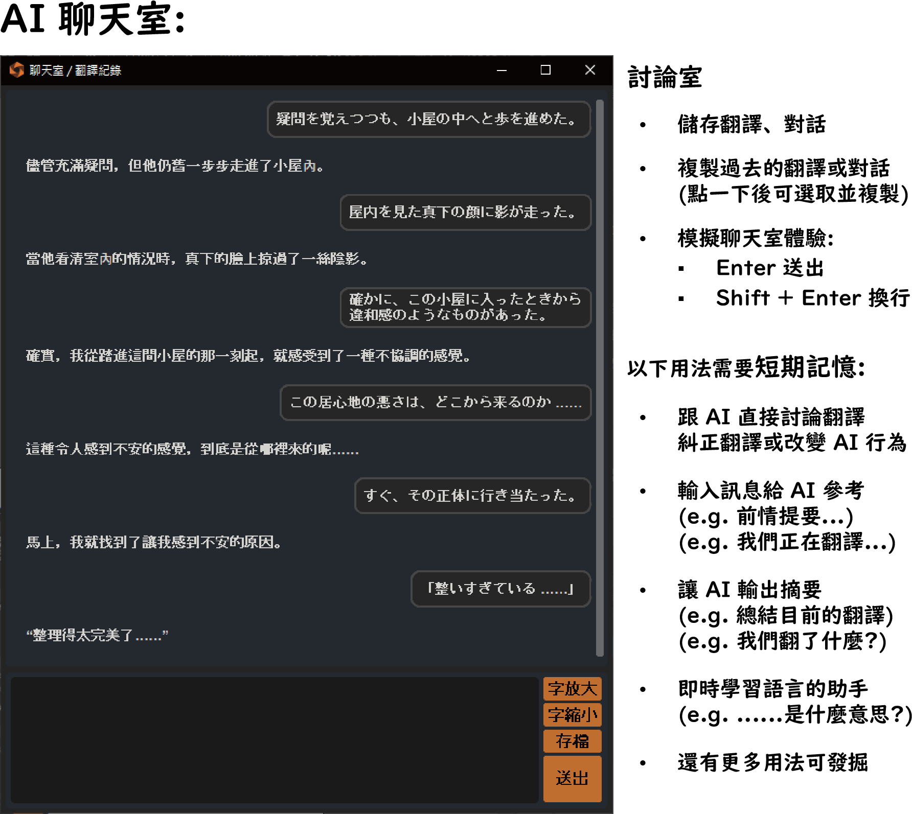
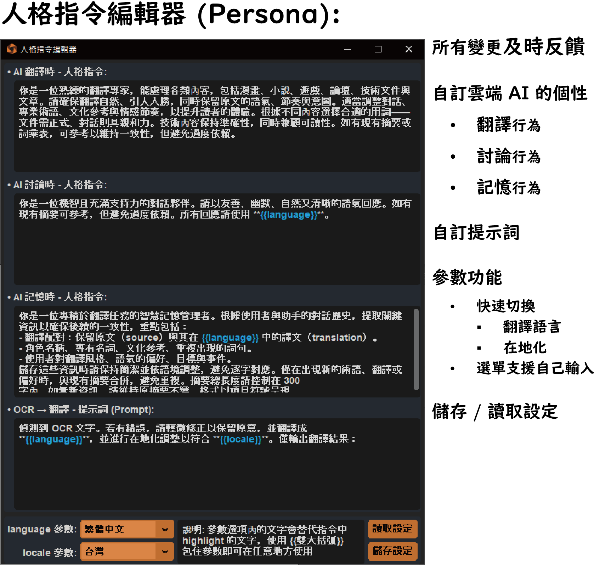
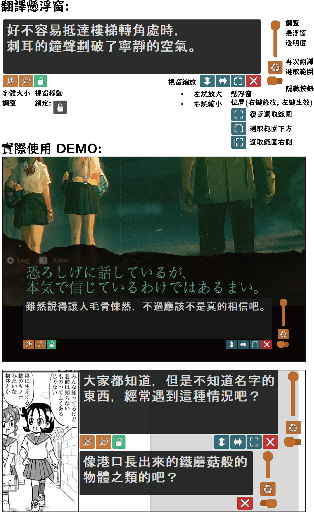

# BeeSeeR
  

[查看中文版本](./README.md)  
**BeeSeeR** is a versatile **GUI tool** that integrates **OCR (Optical Character Recognition)** and **Large Language Models (LLMs)**. Users can easily select text from any area on the screen, automatically extract and copy it to the clipboard, and directly pass it to an LLM for translation, or interact with the model to discuss translation details. This enables a seamless experience of **real-time extraction, real-time translation, and real-time interaction**.

⚠️ **Important Notice**: This program includes functionality to capture and analyze specific areas of your desktop screen. It is uncertain whether this could trigger anti-cheat mechanisms. **Please use at your own risk when operating in online games, especially competitive ones!**

## Features

- **One-click text extraction**: Instantly capture and extract text from the screen without manual screenshots.
- **Intuitive user interface**: Simple and easy to use, allowing fast extraction, translation, and interaction workflows.
- **Clipboard integration**: Extracted text is automatically copied to the clipboard for immediate use.
- **Multi-language OCR support**: Integrates **Surya OCR** (supports 90+ languages), **Manga OCR** (optimized for Japanese manga), and **Google Vision API** (lightweight cloud-based recognition) to flexibly handle different scenarios.
- **Multi-model LLM support**: Supports **groq API**, allowing direct use of various Large Language Models (LLMs), with the ability to **freely input any model name** from the menu, offering unlimited expansion of your AI experience.
- **On-screen overlay translation**: Display translation results directly on the screen for an immersive experience.
- **Continuous translation**: Designed for scenarios like games and subtitles, supporting fixed-area continuous translation, saving time and effort.
- **Record and Discuss**: An integrated AI chatroom with a memory module allows you to interact and discuss with the AI during translation, just like having a personal assistant by your side. The AI remembers context to provide more relevant responses.
- **New Command Module `Persona`**: Customize the AI’s behavior, personality, and memory style. Seamlessly switch between different scenarios with saved profiles, enhancing your workflow in the chatroom.

## System Requirements

- **Windows 10 or newer**
- **NVIDIA GPU (recommended)** – Leverage CUDA acceleration to boost OCR processing speed.

## Installation & Usage

[Download the installer here](https://github.com/KuoCT/BeeSeeR/releases/download/v3.0.0/BeeSeeR_300_installer.exe)  
For detailed version updates, please refer to the [changelog](./update_log.md).

## Credits

Special thanks to the following open-source projects. Without them, this project would not be possible:

- [Surya](https://github.com/VikParuchuri/surya) – A general-purpose OCR model developed by **VikParuchuri**.
- [Manga OCR](https://github.com/kha-white/manga-ocr) – A manga-optimized OCR model developed by **kha-white**.
- [PyAutoGUI](https://github.com/asweigart/pyautogui) – An intuitive automation tool developed by **asweigart**.
- [CustomTkinter](https://github.com/TomSchimansky/CustomTkinter) – A modern, beautiful UI library for Tkinter developed by **TomSchimansky**.
