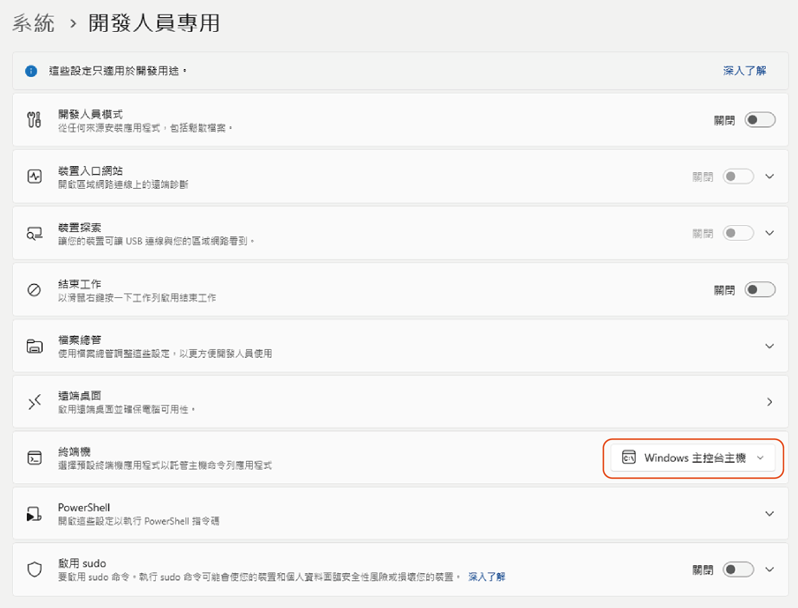

# 常見問題 (FAQ)

### 腳本執行版要如何解除安裝?
以下是最乾淨的解除安裝 v2.x 的步驟，如果你的版本大於v3，則不需要執行步驟 2:
1. 先保存好你的 API 金鑰等資訊
2. BeeSeeR 資料夾中找到 `model_cache_cleaner.bat` 腳本，執行它 (會幫你清除所有模型快取)
3. 把整個資料夾 `shift + del` 清掉 (不放進回收桶直接清除)

---

### 打開程式時終端機會跟著跑出來，有沒有辦法不顯示?  
目前已知 Windows 11 系統預設的託管終端機無法隱藏，請前往 `設定` ，在列表中搜尋 `終端機設定` ，找到 `終端機` *選擇預設終端機應用程式以託管主機命令列應用程式* 選項，將其變更為 `windows 主控台主機` 即可在啟動程式時不顯示終端機。

---

### 我用 NVIDIA 顯卡 Capture 卻顯示 `無法獲取文字辨識結果` 。
如果你用的 OCR 模型是 `Surya-OCR` ，一部分的 NVIDIA 顯卡確時會出現辨識不到文字的狀況，請對著 `Capture` 按右鍵打開 `OCR設定` 視窗，找到 `Surya-OCR` 下 `模型精度` 的設定開關，解除自動並將調整桿撥至 `模型精度: 全精度` ，通常就能解決這種狀況。